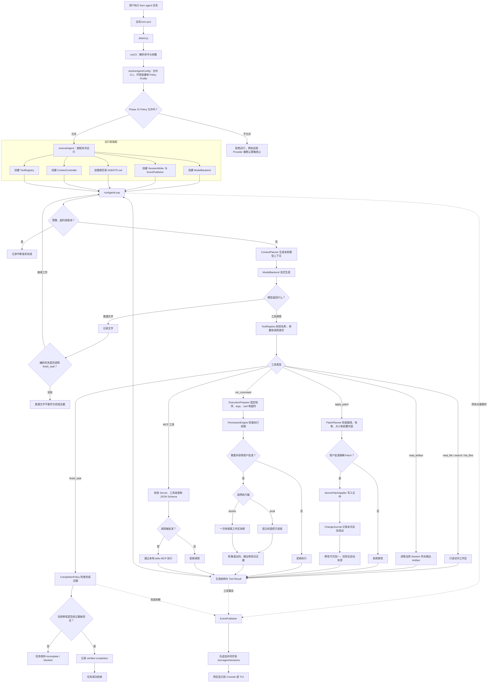

```mermaid
flowchart TD
    A["用户执行 born agent 任务"] --> B["全局 born.ps1"]
    B --> C["dist/cli.js"]
    C --> D["runCli：解析命令与参数"]
    D --> E["resolveAgentConfig：合并 CLI、环境变量和 Policy Profile"]

    E --> F{"Phase 15 Policy 允许吗？"}
    F -- "不允许" --> X1["拒绝运行，例如远程 Provider 被默认策略禁止"]
    F -- "允许" --> G["executeAgent：装配本次运行"]

    subgraph Assembly["运行前装配"]
        G --> H["创建 ModelBackend"]
        G --> I["创建 SessionWriter 与 EventPublisher"]
        G --> J["加载根目录 AGENTS.md"]
        G --> K["创建 ContextController"]
        G --> L["创建 ToolRegistry"]
    end

    H --> M["runAgentLoop"]
    I --> M
    J --> M
    K --> M
    L --> M

    M --> N{"预算、超时或取消？"}
    N -- "是" --> X2["记录中断或未完成"]
    N -- "否" --> O["ContextPlanner 生成本轮模型上下文"]
    O --> P["ModelBackend 流式生成"]
    P --> Q{"模型返回什么？"}

    Q -- "普通文字" --> R["记录文字"]
    R --> S{"编码任务是否调用 finish_task？"}
    S -- "没有" --> X3["普通文字不能作为完成证据"]
    S -- "继续工作" --> M

    Q -- "工具调用" --> T["ToolRegistry 校验名称、参数和调用身份"]
    T --> U{"工具类型"}

    U -- "read_file / search / list_files" --> V["只读访问工作区"]
    U -- "read_artifact" --> W["读取当前 Session 的长输出 Artifact"]

    U -- "apply_patch" --> P1["PatchPlanner 检查路径、哈希、大小和前置内容"]
    P1 --> P2{"用户批准精确 Patch？"}
    P2 -- "否" --> P3["拒绝修改"]
    P2 -- "是" --> P4["AtomicPatchApplier 写入文件"]
    P4 --> P5["ChangeJournal 记录本次实际改动"]
    P5 --> P6["修改代次加一，旧验证自动失效"]

    U -- "run_command" --> C1["ExecutionPreparer 固定程序、argv、cwd 和超时"]
    C1 --> C2["PermissionEngine 检查执行权限"]
    C2 --> C3{"需要并获得用户批准？"}
    C3 -- "否" --> C4["拒绝执行"]
    C3 -- "是" --> C5{"选择执行器"}
    C5 -- "local" --> C6["宿主机受控子进程"]
    C5 -- "docker" --> C7["一次性隔离工作区快照"]
    C6 --> C8["收集退出码、输出和验证证据"]
    C7 --> C8

    U -- "MCP 工具" --> M1["校验 Server、工具来源和 JSON Schema"]
    M1 --> M2{"调用被批准？"}
    M2 -- "否" --> M3["拒绝调用"]
    M2 -- "是" --> M4["通过本地 stdio MCP 执行"]

    U -- "finish_task" --> F1["CompletionPolicy 检查完成证据"]
    F1 --> F2{"当前修改是否经过最新验证？"}
    F2 -- "否" --> X4["任务保持 incomplete / blocked"]
    F2 -- "是" --> F3["记录 verified completion"]
    F3 --> Z["任务成功结束"]

    V --> Y["生成结构化 Tool Result"]
    W --> Y
    P3 --> Y
    P6 --> Y
    C4 --> Y
    C8 --> Y
    M3 --> Y
    M4 --> Y
    Y --> M

    M -. "所有关键事件" .-> EV["EventPublisher"]
    Y -. "工具事实" .-> EV
    F1 -. "完成判断" .-> EV
    EV --> SS["先追加并同步到 .bornagent/sessions"]
    SS --> UI["然后显示到 Console 或 TUI"]
```